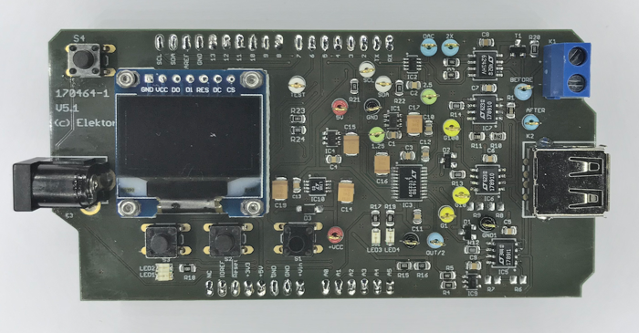

# MicroSupply

# Finish (12/06/2019)

Project Elektor Magazine 170464
(will be published in late 2019)

What is the current consumption of my connected object? Does its standby mode conform to the manufacturer's documentation? How long will the CR2032 battery hold for my object? If you ask these questions, this is an Arduino shield with an adjustable power supply that measures very low currents. The objective is to optimize power consumption. Coupled with its PC software, you can view and memorize the consumption of your object.

contact : [Jennifer AUBINAIS](mailto:jennifer@aubinais.net) 
